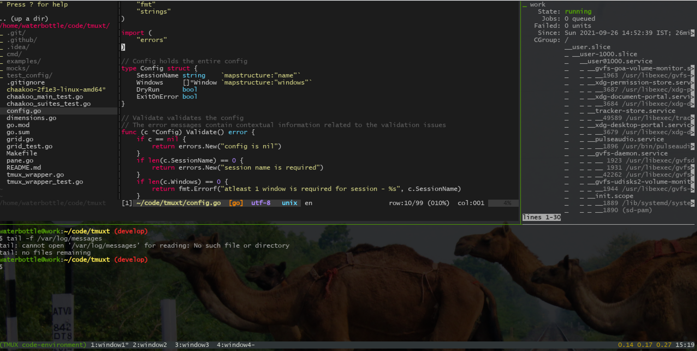
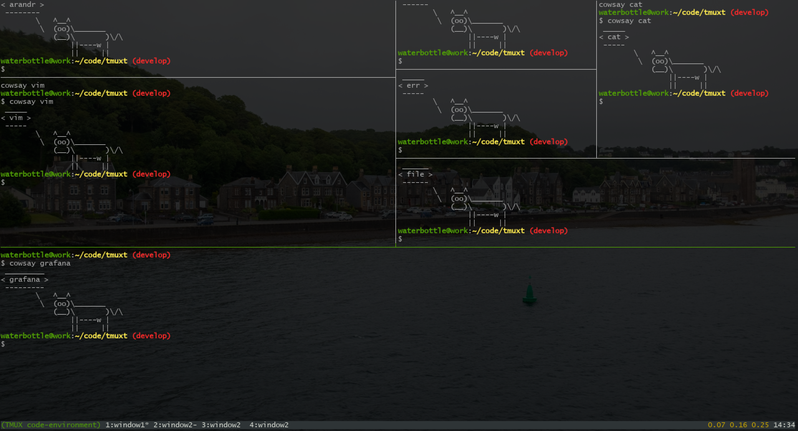

# chaakoo

[](https://github.com/pallavJha/chaakoo/actions/workflows/test.yaml)

1. [Introduction](#introduction)
2. [Configuration](#configuration)
3. [Using Chaakoo](#using-chaakoo)
4. [Examples](#examples)
5. [Download](#download)
6. [License](#license)

## Introduction
Chaakoo is a wrapper over TMUX that can create sessions, windows and panes from a grid based layout. 

For example, this grid:

```
vim  vim  vim  term
vim  vim  vim  term
play play play play
```

will create the following layout:



The layout can be a little complex too based on the further pane divisions, like,

```
arandr  arandr  bzip    cat
vim     vim     err     cat
vim     vim     file    file
grafana grafana grafana grafana
grafana grafana grafana grafana
```



## Configuration

A configuration yaml for one window with 3 panes, like, the first example, is here:
```yaml
name: code-environment
windows:
  - grid: |
      vim  vim  vim  term
      vim  vim  vim  term
      play play play play
    name: window1
    commands:
      - pane: vim
        command: |
          vim
      - pane: term
        command: |
          cd ~
          systemctl status
        workdir: /home/waterbottle/code
      - pane: play
        command: |
          tail -f /var/log/messages
```

- `name` is the TMUX session name
- `windows` is an array of windows
- Each window contains
  - `name` - The name of the window
  - `grid` - 2D layout or the grid, each distinct name in the layout represents a pane.
  - `commands` is an array of the commands that will be executed in a pane
  - Each command object contains:
    - `pane` - Name of the pane
    - `command` - Can contain multi line text for the commands
    - `workdir` - Pane's first directory. It can further be changed by `cd` present in `command`

**Note**: The `commands` section or commands for a pane are not a required field. Chaakoo can just be used to create the pane 
layout and then the user can take over and execute their commands.

## Using Chaakoo

- Starting a session

```bash
# Start a TMUX server
$ tmux start-server

# and then pass the config to Chaakoo
$ chaakoo -c examples/1/chaakoo.yaml 
4:43PM ERR github.com/pallavJha/chaakoo/tmux_wrapper.go:349 > unable to get the list of the present sessions error="exit status 1" sessionName=code-environment stderr="no server running on /tmp/tmux-1000/default\n" stdout=
4:43PM INF github.com/pallavJha/chaakoo/cmd/chaakoo.go:66 > session created successfully, it can be attached by executing:
4:43PM INF github.com/pallavJha/chaakoo/cmd/chaakoo.go:67 > tmux a -t code-environment

# Attach the TMUX session
$ tmux a -t code-environment
```

- Starting with the `--verbose` or `-v` flag will set the log level to `DEBUG` and time format to `RFC3339`
```bash
$ chaakoo -c examples/1/chaakoo.yaml -v
2021-09-26T16:47:50+05:30 DBG github.com/pallavJha/chaakoo/cmd/chaakoo.go:128 > setting global log level to DEBUG as verbose log is enabled
2021-09-26T16:47:50+05:30 DBG github.com/pallavJha/chaakoo/cmd/chaakoo.go:98 > using examples/1/chaakoo.yaml
2021-09-26T16:47:50+05:30 DBG github.com/pallavJha/chaakoo/cmd/chaakoo.go:114 > using config file: examples/1/chaakoo.yaml
2021-09-26T16:47:50+05:30 DBG github.com/pallavJha/chaakoo/cmd/chaakoo.go:50 > finding the dimensions
2021-09-26T16:47:50+05:30 DBG github.com/pallavJha/chaakoo/cmd/chaakoo.go:56 > found dimensions height=81 width=274
-- more logs --
```

- For more info:
```bash
$ chaakoo --help
chaakoo converts the 2D grids or matrix into TMUX windows and panes

Usage:
  chaakoo [flags]

Flags:
  -c, --config string   config file (default is ./chaakoo.yaml)
  -d, --dry-run         if true then commands will only be shown and not executed
  -e, --exit-on-error   if true then chaakoo will exit after it encounters the first error during command execution
  -r, --height int      terminal dimension for rows or height, if 0 then rows and cols will be found internally
  -h, --help            help for chaakoo
  -v, --verbose         enable verbose logging
  -V, --version         print the version
  -w, --width int       terminal dimension for cols or width
```

## Examples
There are more examples present in the [examples](./examples) directory with configurations and snapshots.

## Download
The latest binary can be downloaded from the [latest GitHub release](https://github.com/pallavJha/chaakoo/releases/latest).
The binaries are statically linked.

## License
   Copyright 2021 Pallav Jha

   Licensed under the Apache License, Version 2.0 (the "License");
   you may not use this file except in compliance with the License.
   You may obtain a copy of the License at

       http://www.apache.org/licenses/LICENSE-2.0

   Unless required by applicable law or agreed to in writing, software
   distributed under the License is distributed on an "AS IS" BASIS,
   WITHOUT WARRANTIES OR CONDITIONS OF ANY KIND, either express or implied.
   See the License for the specific language governing permissions and
   limitations under the License.
