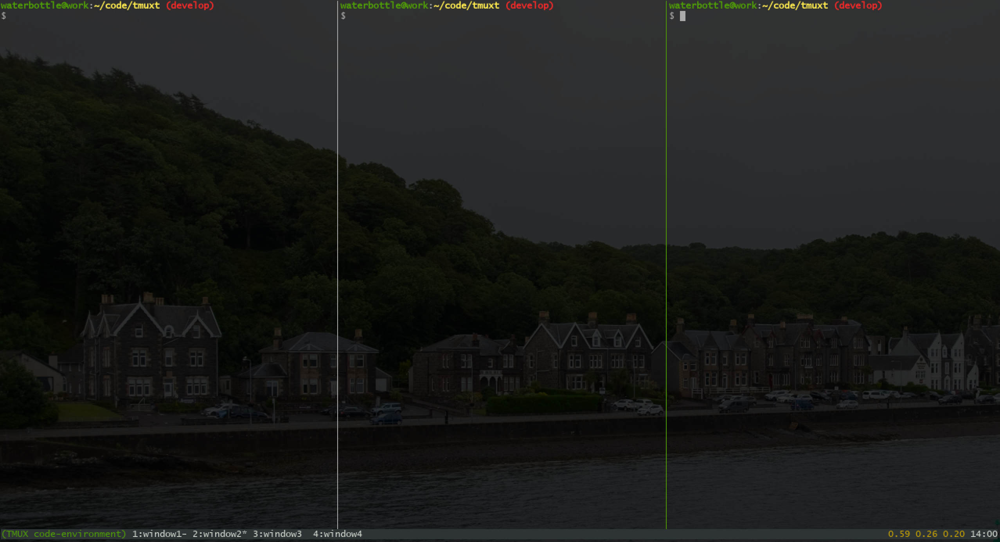
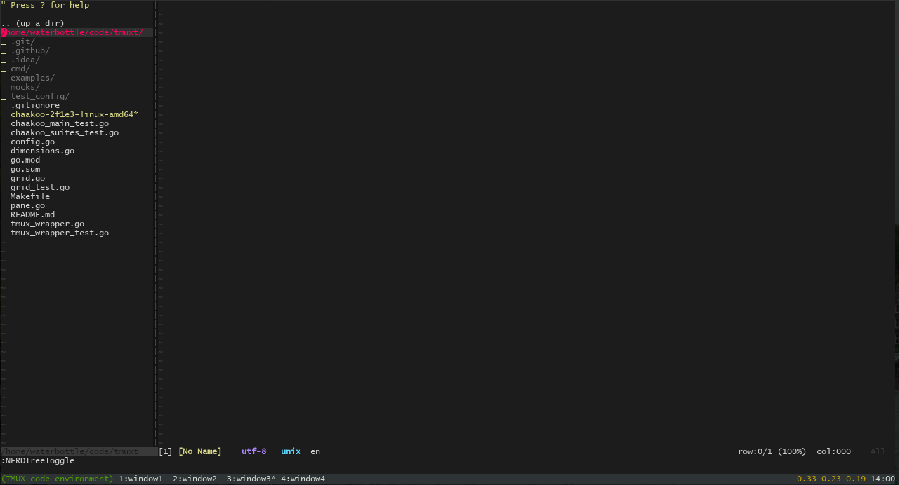
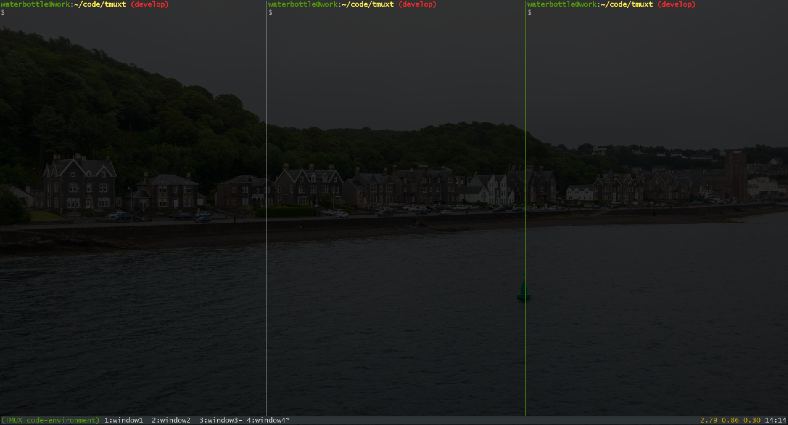

## Configuration

```yaml
name: code-environment
windows:
  - grid: |
      vim  vim  vim  term
      vim  vim  vim  term
      play play play play
    name: window1
    commands:
      - pane: vim
        command: |
          vim
      - pane: term
        command: |
          cd ~
          systemctl status
        workdir: /home/waterbottle/code
      - pane: play
        command: |
          tail -f /var/log/messages
  - grid: |
      vim1  vim2  vim3
    name: window2
  - grid: |
      vim1
    name: window3
    commands:
      - pane: vim1
        command: |
          cd ~/code
          cd tmuxt
          vim
  - grid: |
      vim1  vim2  vim3
      vim1  vim2  vim3
      vim1  vim2  vim3
    name: window4
```

## Snapshots




